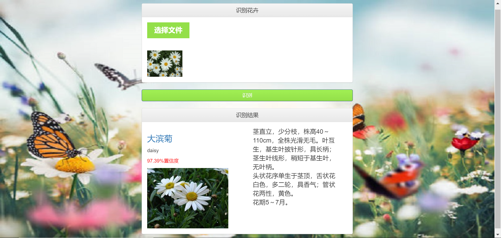

# 简介
- 基于深度学习的识花系统的web界面
# 关于技术
- 使用了SpringBoot框架，使用DJL(Deep Java Learning)调用训练好的模型
# 有关参考
- DJL的使用参考https://docs.djl.ai/jupyter/load_pytorch_model.html、https://javadoc.io/doc/ai.djl/api/latest/index.html
# 识别结果显示

